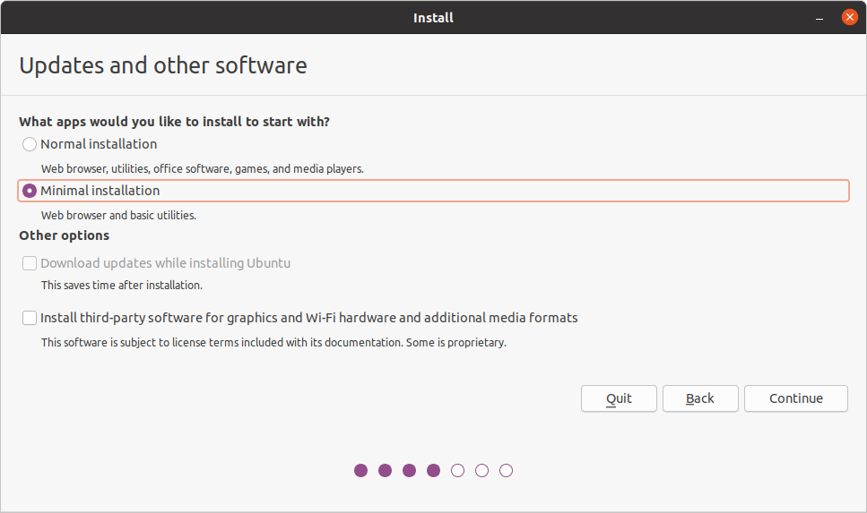
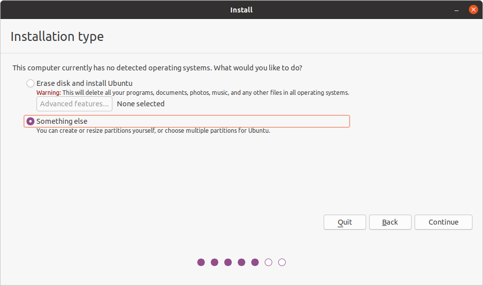
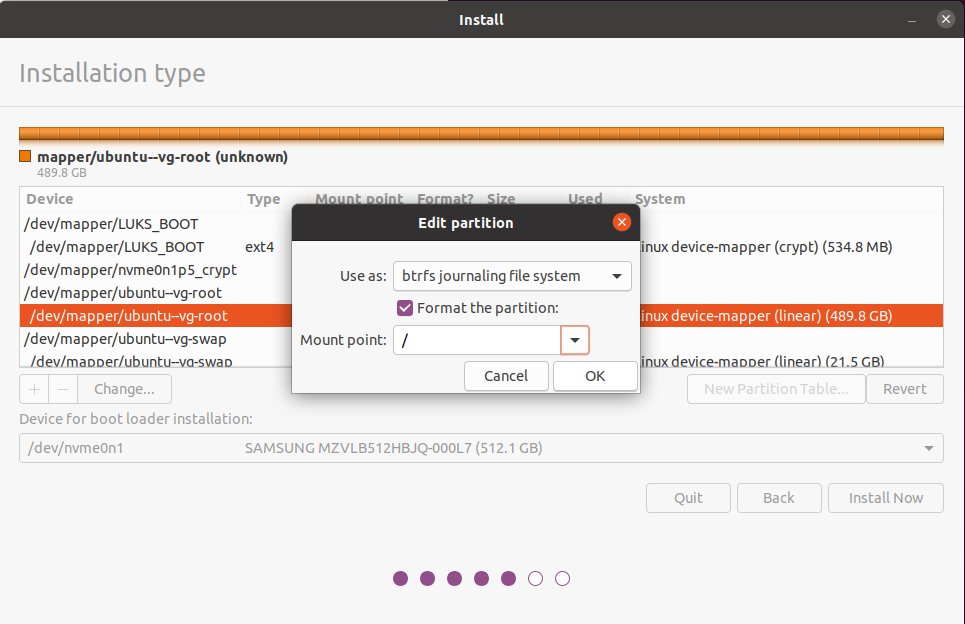
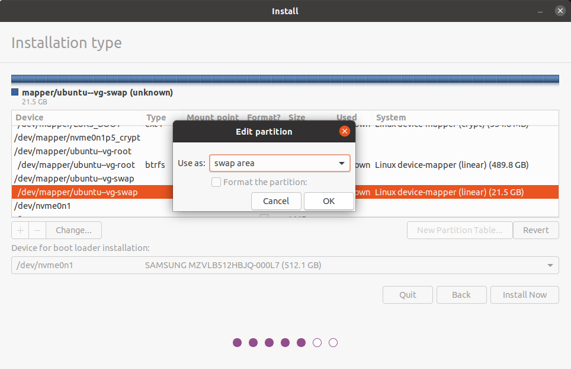
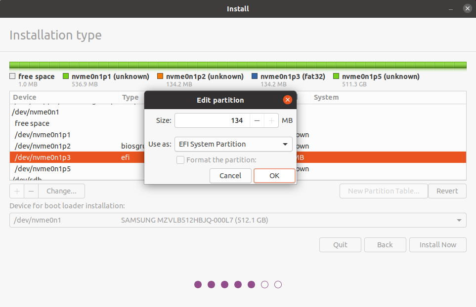
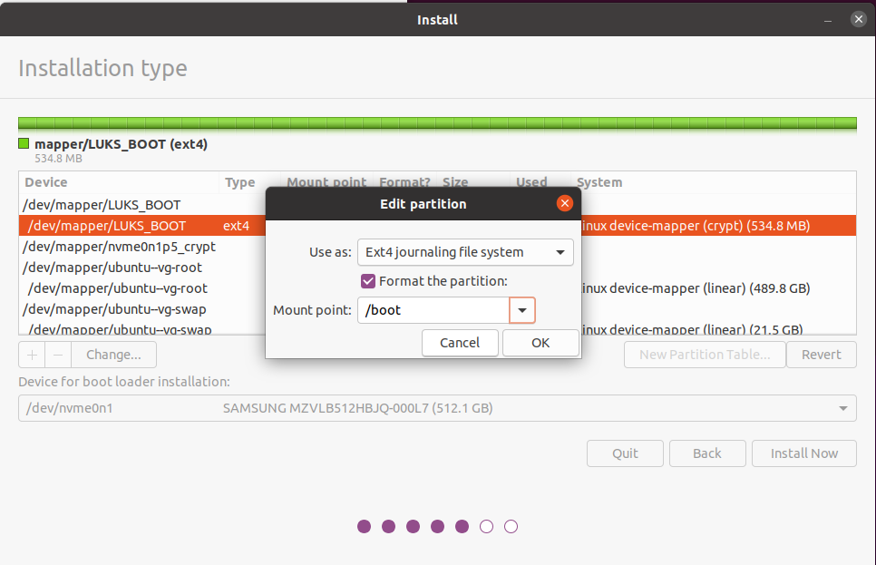
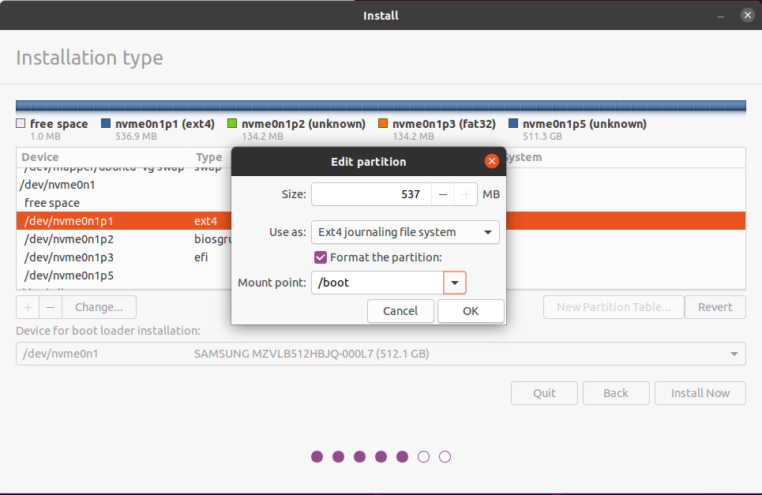
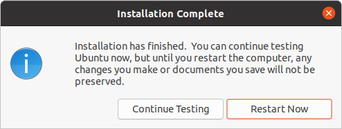

# Ubuntu Easy Full-Disk-Encryption
Easy to use script to create fully encrypted disk under Ubuntu including the boot section (GRUB) and support for btrfs.

## What it can
The script simple automate the process of partitioning the drive according to the desired setup. It creates all needed LUKS container.
You can encrypt the boot section of the drive so the bootloader is also protected.
Also it is possible to create keyfiles, so only have to enter the passphrase once at boot time in order to decrypt all drives.

## How to use
### Create a bootable device
You can simply build a bootable USB stick like described [here](https://ubuntu.com/tutorials/tutorial-create-a-usb-stick-on-ubuntu "Create a bootable USB stick on Ubuntu").

### Boot from USB
Next you boot from UEFI Mode to the Ubuntu live system. Just select "Try Ubuntu".

### Run the script
Copy booth shell scripts into the same folder on the the live system.

Open the terminal and switch to root:
```bash
sudo -i
```
Run the script:
```bash
./ubuntu_easy_fde.sh
```

Simply follow the instructions of the script.

After a while the ubuntu install program will start.

#### Ubuntu installer
Choose "Minimal installation"


At installation type choose "Something else"


Now we are at the partitioning of the installer. Simple edit your settings as described in the pictures. For the root system you can choose ext4 or btrfs.


Mark the swap partition


And aleso the /efi partition


##### with encrypted /boot
Edit the LUKS_BOOT partition as the following image:


##### without encrypted /boot
Edit the *diskname*1 partition as the following image:


##### Device for boot loader installation
Make sure you selected the right device for the bootloader installation. You have to select the device **NOT** a partition.


When you are done, click Install Now.

After the installation finished, you will be asked if you want to continue testing, which we want because we have to configure some more things.



The script will tell you when it finished. After that you are ready to reboot your system.


## Contributing
Any help or ideas are greatly appreciated!

When you find a bug, just fix it or tell me and open an issue.

The code is not the cleanest...
Maybe its a good idea to rewrite it with function calls. So it would be very easy to implement multiple drives and disk-groups with the use of "keyscript=decrypt_keyctl"


## More Info
I used code and inspiration from Ubuntu community Help Wiki [Full_Disk_Encryption_Howto_2019](https://help.ubuntu.com/community/Full_Disk_Encryption_Howto_2019), (CC BY-SA 3.0)


## License

Shield: [![CC BY-SA 4.0][cc-by-sa-shield]][cc-by-sa]

This work is licensed under a [Creative Commons Attribution-ShareAlike 4.0
International License][cc-by-sa].

[![CC BY-SA 4.0][cc-by-sa-image]][cc-by-sa]

[cc-by-sa]: http://creativecommons.org/licenses/by-sa/4.0/
[cc-by-sa-image]: https://licensebuttons.net/l/by-sa/4.0/88x31.png
[cc-by-sa-shield]: https://img.shields.io/badge/License-CC%20BY--SA%204.0-lightgrey.svg
